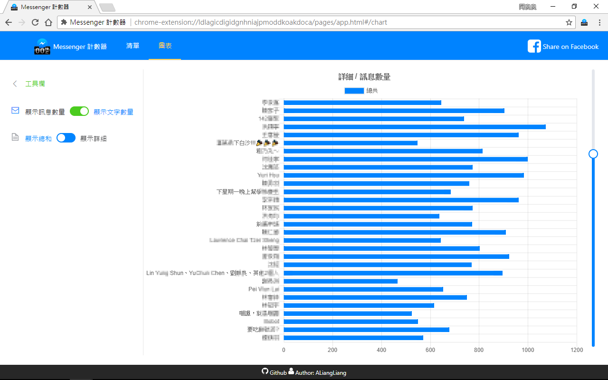

#  Messenger 計數器

🌎 | [English](README.md) | 正體中文 (Traditional Chinese)
------------- | ------------- | -------------

統計你在 Messenger 中，與朋友們的訊息數量，並且排名！！
快來看看你與哪個朋友最麻吉唄！
想不想知道與好朋友聊了幾句？想回味與她聊天的點點滴滴嗎？
這時候這碗糕就派上用場了！！還不快安裝！？

  

  

## 🔥 特色

- 💬 **統計**
  - 多少聊天室
  - 聊天室的訊息量
  - 聊天室的文字量
- 📊 將所有聊天室**排名**
- 💾 **下載**聊天紀錄
- ⚙️ **設定**你的聊天室 (表情符號、顏色、名稱等...)

## 📄 使用
安裝完畢後，點擊 Chrome 右上角的 LOGO 圖示 ，如果找不到，點擊右上角的「三顆點」按鈕，就可以找到了。  

## 🔧 貢獻

如果你喜歡這個套件的話，又或是想要新的功能、修復 bug，歡迎 [PR](https://github.com/ALiangLiang/Counter-for-Messenger/compare) 或是[建立 issue](https://github.com/ALiangLiang/Counter-for-Messenger/issues/new)，閱讀[貢獻守則](.github/CONTRIBUTING.md)來瞭解更多資訊。

如果你有一定的技術，可以使用[公開測試版本](https://chrome.google.com/webstore/detail/flkejcheidpcclcdokndihmnlejfabil)
，並且幫助我們在釋出正式版前找出錯誤。

### 🌎 翻譯

我們歡迎大家增加各種語言的支援，協助各位的同胞使用這個擴充套件。可以參考 [CONTRIBUTING - Working with translations](.github/CONTRIBUTING.md#working-with-translations)。

## 📣 聲明

- **這是非官方專案**  
- **不會收集使用者從 Messenger 來的數據**
