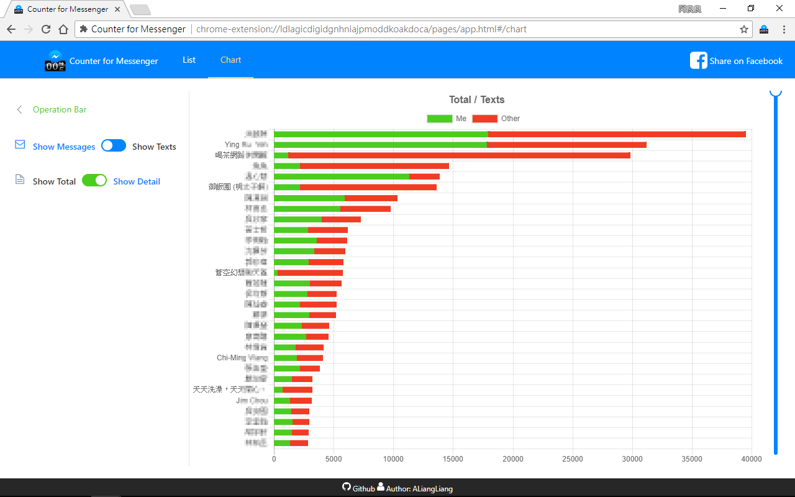
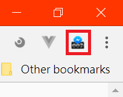
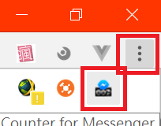

#  Counter for Messenger

Chome
[ ](https://chrome.google.com/webstore/detail/ldlagicdigidgnhniajpmoddkoakdoca)
[](https://chrome.google.com/webstore/detail/ldlagicdigidgnhniajpmoddkoakdoca)
[](https://chrome.google.com/webstore/detail/ldlagicdigidgnhniajpmoddkoakdoca)
[](https://chrome.google.com/webstore/detail/flkejcheidpcclcdokndihmnlejfabil)

Firfox
[ ](https://addons.mozilla.org/firefox/addon/counter-for-messenger/)
[](https://addons.mozilla.org/firefox/addon/counter-for-messenger/)
[](https://addons.mozilla.org/firefox/addon/counter-for-messenger/)

🌎 | English | [正體中文 (Traditional Chinese)](README-zh-TW.md)
--- | ------ | -------------

Count and rank your friends or lover by analysis you Messenger!!  
Take a look what you and your best friend chat!!

<p align="center">
  <a href="https://chrome.google.com/webstore/detail/ldlagicdigidgnhniajpmoddkoakdoca">
    
  </a>
</p>

<p align="center">
  
</p>

## 🔥 Features

- 💬 **Count**
  - Threads (Chat rooms)
  - Messages in thread
  - Characters in thread
- 📊 **Rank** all your threads on chart.
- 💾 **Backup**(Download) your messages.
- ⚙️ **Customize** your threads. (color, emoji, name...)

## 📄 Instructions
After installed, click the logo  on the top right of Chrome browser.  
If no any icon there, click "three dot" button and you can found the logo.  



## 🔧 Contributing

Like Counter of Messenger? Want new feature or bug fixes?  
Please contribute to the project either by [_creating a PR_](https://github.com/ALiangLiang/Counter-for-Messenger/compare) or [_submitting an issue_](https://github.com/ALiangLiang/Counter-for-Messenger/issues/new) on GitHub.  
Read the [contribution guide](.github/CONTRIBUTING.md) for more detailed information.

If you're technically-savvy, you can use our [beta version](https://chrome.google.com/webstore/detail/flkejcheidpcclcdokndihmnlejfabil) and help us find bugs before they're released to the public.

### 🌎 Translation

Welcome every language support. Help your countryman to use this application. Ref [CONTRIBUTING - Working with translations](.github/CONTRIBUTING.md#working-with-translations)

## 📣 Declaration

- **It's a unofficial project.**
- **We would not collect any user data from Messenger.**

## Development

```
yarn # install dependencies
# Chrome
npm run dev # for development
npm run build-chrome # for production
# Firefox
npm run dev-firefox # for development
npm run build-firefox # for production
```
