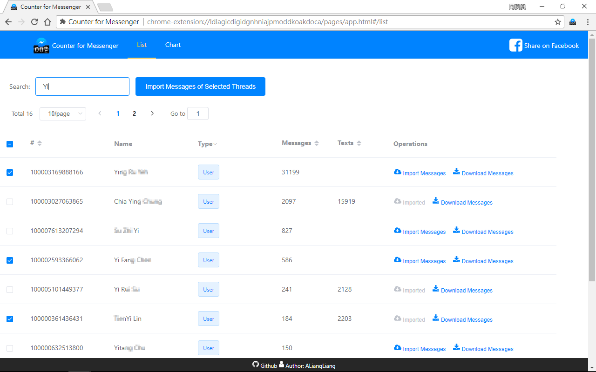

# Counter-for-Messenger

Statistics your Messenger , the number of messages with friends and rank ! !
Take a look at what you and your best friend best friends chant !

Instructions for use:
After installation, click on the icon in the top right button Chrome .

How to download messages history:
right click chart bar, and select "Download history".

***We would not collect any user data.***

## Contributing

Like Counter of Messenger? Want new feature or bug fixes?
Please contribute to the project either by [_creating a PR_](https://github.com/ALiangLiang/Counter-for-Messenger/compare) or [_submitting an issue_](https://github.com/ALiangLiang/Counter-for-Messenger/issues/new) on GitHub.
Read the [contribution guide](.github/CONTRIBUTING.md) for more detailed information.

## Language

- English
- [正體中文 (Traditional Chinese)](README-zh-TW.md)
